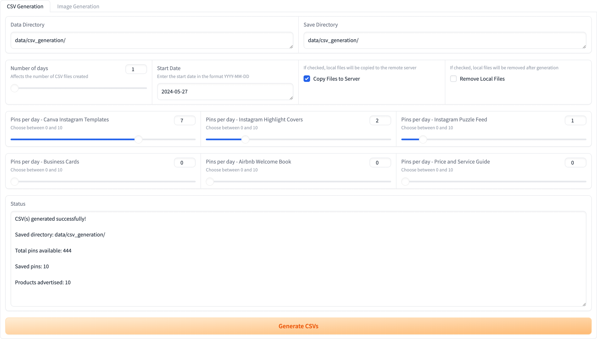
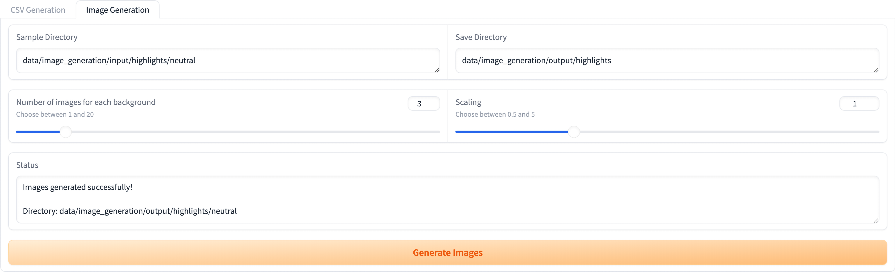

# Atriel Studio

<a name="contents"></a>
## 📖 Contents
- [Introduction](#introduction)
- [Requirements](#requirements)
- [Installation](#installation)
- [Docker Running](#docker)


<a name="introduction"></a>
## 🎯 Introduction
This repository is devoted to the ongoing maintenance of the Atriel Studio shop, where we specialize in providing essential tools and resources for graphic designers and businesses. Our algorithms and scripts streamline image generation and optimize content for platforms like Pinterest, ensuring your brand shines with captivating designs.

The Atriel Studio shop is dedicated to helping your brand stand out with eye-catching designs and efficient workflows. Join us as we continue to enhance the shop, empowering designers and businesses worldwide.

The shop is available on multiple platforms and marketplaces:

- **Atriel Studio:** https://atriel-studio.com/
- **Etsy:** https://atrielstudio.etsy.com/
- **Creative Market:** https://creativemarket.com/LiliesandBerries
- **Pinterest:** https://creativemarket.com/LiliesandBerries

<p align="center">
  
</p>

<p align="center">
    <em><strong>Figure 3.</strong> Comparison of models for microvascular segmentation in tissue-engineered vascular grafts.</em>
</p>


<a name="requirements"></a>
## 💻 Requirements
- Operating System
  - [x] macOS
  - [x] Linux
  - [x] Windows (limited testing carried out)
- Python 3.12.x
- Required core libraries: [environment.yaml](environment.yaml)

<a name="installation"></a>
## ⚙ Installation
**Step 1:** Install Miniconda

Installation guide: https://docs.conda.io/projects/miniconda/en/latest/index.html#quick-command-line-install

**Step 2:** Clone the repository and change the current working directory
``` bash
git clone https://github.com/ViacheslavDanilov/atriel-studio.git
cd atriel-studio
```

**Step 3:** Set up an environment and install the necessary packages
``` bash
chmod +x make_env.sh
./make_env.s
```

<a name="docker"></a>
## 📦 Docker Running
**Step 1:** Install Docker

Installation guide: https://www.docker.com/products/docker-desktop/

**Step 2:** Clone the repository and change the current working directory
``` bash
git clone https://github.com/ViacheslavDanilov/atriel-studio.git
cd atriel-studio
```

**Step 3:** Build the Docker image
``` bash
docker build -t atriel-app .
```

**Step 5:** Run the Docker container with volume and port mapping
``` bash
docker run -it -v /Users/viacheslav.danilov/projects/personal/atriel-studio:/atriel-studio -p 7860:7860 -p 7822:7822 atriel-app
```

<p align="center">
  
</p>

<p align="center">
    <em>Interface for bulk upload pins to Pinterest.</em>
</p>


<p align="center">
  
</p>

<p align="center">
    <em>Interface for image generation pipeline.</em>
</p>
